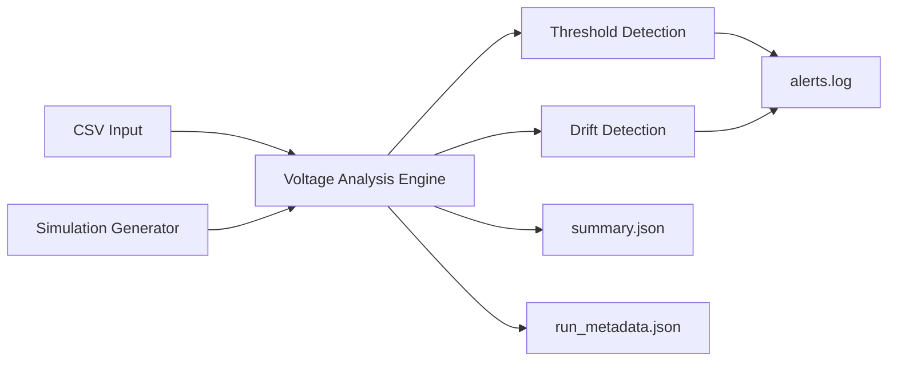

# Voltage Observability Monitor (230V RMS) — CLI Analysis Utility

A lightweight command-line diagnostic utility for analysing 230V RMS voltage behaviour and identifying instability patterns in electrical and industrial environments.

A small, read-only command-line tool for offline analysis of 230V RMS voltage data.  
It detects threshold violations (WARN/ALARM) and optional step-based drift, then produces structured logs and summaries for troubleshooting and validation.

## Why this exists

Voltage instability can cause:
- sporadic electronic faults and resets
- nuisance alarms during downtime/startup
- missing context when commissioning or diagnosing issues

This tool provides independent observability **without changing PLC logic**.

## Features

- CSV analysis (`--csv`) or synthetic simulation (`--simulate`)
- WARN / ALARM classification using thresholds
- Optional DRIFT detection (`--drift`, `--drift-threshold`)
- Outputs:
  - `alerts.log` (chronological events)
  - `summary.json` (stats + counts)
  - `run_metadata.json` (run context + SHA256 integrity hash)


The utility follows a simple diagnostic pipeline for analysing voltage behaviour.


## Example CLI Output

Example simulated run:

```bash
python3 monitor.py --simulate --minutes 1 --drift --out output_test
```

Output files generated:

- alerts.log
- summary.json
- run_metadata.json
